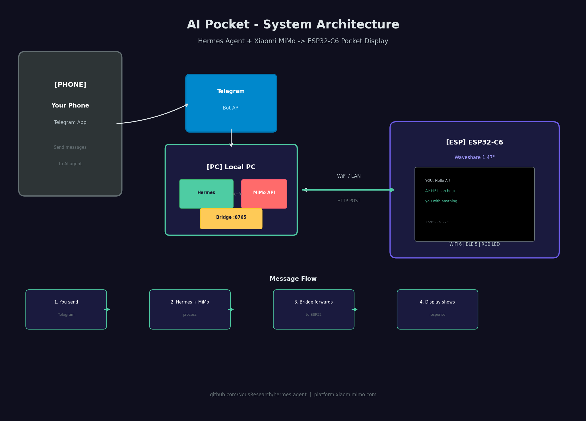

# AI Pocket - Portable AI Agent Display

A portable **AI pocket companion** built with the **ESP32-C6 Waveshare 1.47"** display, connected to **Hermes Agent** by Nous Research using **Xiaomi MiMo** as the LLM backend. Chat with your AI via Telegram and see responses on a pocket-sized display with **mood-aware RGB LED** and **auto-scrolling text**.



## What This Is

**AI Pocket** turns an ESP32-C6 microcontroller with a tiny 1.47" LCD into a portable display for your AI agent. Here's how it works:

1. You send a message to **@pocket_mimo_bot** via Telegram on your phone
2. The **AI Bridge** processes your message using **Hermes Agent** (Xiaomi MiMo LLM)
3. The AI response is **pushed in real-time** to the ESP32-C6 display over your local WiFi
4. You see both your message and the AI's response on the pocket display
5. The **RGB LED** changes color based on the AI's mood
6. Long responses **auto-scroll** like a marquee

## Features

### 🎨 Mood System (9 Moods)
| Mood | Emoji | RGB LED Color | Trigger Keywords |
|------|-------|---------------|------------------|
| Happy | 😊 | 🟡 Yellow pulse | senang, bagus, mantap, happy |
| Angry | 😠 | 🔴 Red flicker | kesel, marah, dongkol, jengkel |
| Sad | 😢 | 🔵 Blue breathe | sedih, galau, capek, lelah |
| Excited | 😄 | 🟣 Magenta pulse | wow, amazing, luar biasa, keren |
| Thinking | 🤔 | 🔵 Cyan rotate | hmm, let me think, interesting |
| Strong | 💪 | 🟢 Green steady | berhasil, selesai, siap, done |
| Neutral | 😐 | ⚪ Dim white | default fallback |
| Wave | 👋 | 🟡 Yellow-green | halo, hello, hey |
| Love | ❤️ | ❤️ Red-pink heartbeat | love, cinta, sayang |

### 💡 RGB LED
- Built-in RGB LED (GPIO8) reflects current mood
- Breathing/pulse animations for each mood
- GRB color order for Waveshare ESP32-C6

### 📜 Auto-Scroll Marquee
- Long AI responses auto-scroll upward
- 3s pause at top, 2px/150ms scroll speed, 2s pause at bottom
- Scroll indicator dots on bottom-right of AI bubble

### 🤖 AI Bridge
- **Hybrid mode**: Fast MiMo API for chat + Hermes CLI for computer access
- Regular chat → Direct MiMo API (3-7s response time) ⚡
- Computer commands → Hermes CLI (folder, disk, process access) 💻
- Auto-detects intent: keywords like "folder", "file", "disk", "hardisk", "process" trigger Hermes
- Typing indicator on Telegram while processing
- "Thinking..." display on ESP32 during AI response generation
- Auto-replies to user with AI-generated responses

### 📝 Multi-Paragraph Support
- Handles `\n` (Unix) and `\r\n` (Windows) line breaks correctly
- Multi-paragraph AI responses display fully on screen with auto-scroll
- Fixed newline-at-start-of-line bug that caused text truncation

### 🕐 Real-Time Clock
- NTP-synced time display (configurable timezone)
- Blinking colon animation
- Date and day of week

### 📊 Display Layout
```
┌─────────────────────┐
│  19:36      [|||]●  │  ← Clock + WiFi signal + status dot
│  31 May Sun         │  ← Date + Day
├─────────────────────┤
│  😊 Happy Ready     │  ← Mood emoji (24x24) + label
│  ● ● ●              │  ← Animated dots
├─────────────────────┤
│  YOU                │  ← User message label
│  ┌─────────────┐    │
│  │ Hello AI!   │    │  ← User chat bubble
│  └─────────────┘    │
│  AI                 │  ← AI response label
│  ┌─────────────┐    │
│  │ Hi there!   │    │  ← AI chat bubble (scrollable)
│  │ How can I.. │    │
│  └─────────────┘    │
├─────────────────────┤
│  AI Pocket v2.0     │  ← Status bar
│  192.168.90.37      │
└─────────────────────┘
```

## Hardware Requirements

| Component | Specification | Notes |
|-----------|--------------|-------|
| **MCU** | Waveshare ESP32-C6-LCD-1.47 | 160MHz RISC-V, WiFi 6, BLE 5 |
| **Display** | 1.47" TFT LCD | 172x320px, ST7789 driver, 262K colors |
| **Storage** | 16MB Flash + TF card slot | For firmware and assets |
| **LED** | RGB color LED (GPIO8) | WS2812, GRB order |
| **Power** | USB-C 5V | Or 3.7V LiPo via GPIO |

## Project Structure

```
esp32-c6-mimo-hermes/
├── esp32_firmware/
│   ├── esp32_firmware.ino    # Main firmware (v2.0 Trendy Edition)
│   └── secrets.h             # WiFi credentials (gitignored)
├── pc_bridge/
│   ├── bridge_server.py      # PC bridge server (Hermes → ESP32)
│   ├── telegram_bridge.py    # AI-powered Telegram bridge
│   ├── requirements.txt      # Python dependencies
│   └── .env                  # Bot token & config (gitignored)
├── .gitignore
└── README.md
```

## Quick Start

### Prerequisites

- **Hardware**: Waveshare ESP32-C6-LCD-1.47
- **Software**: Arduino CLI or Arduino IDE 2.0+
- **Account**: Telegram Bot Token (from @BotFather)
- **LLM**: Hermes Agent installed with Xiaomi MiMo provider

### Step 1: Flash the ESP32 Firmware

#### 1.1 Install Arduino CLI

```bash
# Install arduino-cli
curl -fsSL https://raw.githubusercontent.com/arduino/arduino-cli/master/install.sh | sh

# Install ESP32 board support
arduino-cli core update-index
arduino-cli core install esp32:esp32

# Install required libraries
arduino-cli lib install "LovyanGFX"
arduino-cli lib install "ArduinoJson"
```

#### 1.2 Configure WiFi

Create `esp32_firmware/secrets.h`:

```cpp
#ifndef SECRETS_H
#define SECRETS_H

const char* WIFI_SSID = "YourWiFiName";
const char* WIFI_PASSWORD = "***";

#endif
```

#### 1.3 Configure Timezone

In `esp32_firmware/esp32_firmware.ino`, find and modify:

```cpp
// Change to your timezone (UTC offset in seconds)
const long GMT_OFFSET_SEC = 8 * 3600;  // UTC+8 (Malaysia/Singapore)
// const long GMT_OFFSET_SEC = 7 * 3600;  // UTC+7 (WIB Indonesia)
```

#### 1.4 Compile and Flash

```bash
# Compile
arduino-cli compile --fqbn esp32:esp32:esp32c6 \
  --libraries ~/Arduino/libraries \
  esp32_firmware/

# Flash (check your port: /dev/ttyACM0 or /dev/ttyACM1)
arduino-cli upload --fqbn esp32:esp32:esp32c6 \
  --port /dev/ttyACM0 \
  esp32_firmware/
```

After flashing, the display will show:
- Boot screen with "AI Pocket v2.0"
- WiFi connection status
- IP address (write this down!)

### Step 2: Set Up the Telegram Bot

#### 2.1 Create Bot

1. Open Telegram, search for **@BotFather**
2. Send `/newbot`
3. Follow prompts to name your bot
4. Copy the **bot token** (e.g., `123456789:ABCdefGHIjklMNOpqrsTUVwxyz`)

#### 2.2 Get Your Chat ID

1. Send a message to your new bot
2. Open: `https://api.telegram.org/bot<YOUR_TOKEN>/getUpdates`
3. Find your `chat.id` in the response

### Step 3: Set Up the AI Bridge

#### 3.1 Install Dependencies

```bash
cd pc_bridge
python3 -m venv .venv
source .venv/bin/activate
pip install -r requirements.txt
```

#### 3.2 Configure Environment

Create `pc_bridge/.env`:

```env
TELEGRAM_BOT_TOKEN=123456789:ABCdefGHIjklMNOpqrsTUVwxyz
TELEGRAM_CHAT_ID=your_chat_id_here
ESP32_IP=192.168.90.37
MIMO_API_KEY=your_mimo_api_key_here
MIMO_API_URL=https://token-plan-sgp.xiaomimimo.com/v1
```

#### 3.3 Start the Hybrid AI Bridge

```bash
cd pc_bridge
source .venv/bin/activate
python telegram_bridge.py --esp32-ip 192.168.90.37
```

The bridge will:
- Connect to Telegram and poll for messages
- **Chat mode**: Call MiMo API directly for fast responses (3-7s)
- **Computer mode**: Call Hermes CLI for system access (folder, disk, etc.)
- Forward all responses to ESP32 display
- Reply to Telegram with the AI response
- Show typing indicator on Telegram while processing

### Step 4: Test Everything

1. **Start the bridge** (if not running):
   ```bash
   cd pc_bridge && source .venv/bin/activate && python telegram_bridge.py
   ```

2. **Send a message** to your Telegram bot (e.g., "hello")

3. **Watch the magic** — your ESP32 display should show:
   - Your message in the "YOU" bubble
   - AI response in the "AI" bubble
   - Mood emoji and RGB LED color based on response

## API Reference

### ESP32-C6 Endpoints

| Endpoint | Method | Description |
|----------|--------|-------------|
| `/` | GET | Web control panel |
| `/message` | POST | Receive message to display (JSON or form) |
| `/status` | GET | Get device status (JSON) |
| `/led` | POST | Control RGB LED (`{"state":"on"}` or `{"state":"off"}`) |

### Bridge Server Endpoints

| Endpoint | Method | Description |
|----------|--------|-------------|
| `/` | GET | Bridge status page |
| `/hermes/webhook` | POST | Hermes Agent webhook receiver |
| `/display/message` | POST | Direct message to ESP32 |
| `/esp32/status` | GET | Check ESP32 connectivity |
| `/esp32/led` | POST | Control ESP32 LED remotely |

### Direct API Test (cURL)

Send a test message directly to ESP32:
```bash
curl -X POST http://192.168.90.37/message \
  -H "Content-Type: application/json" \
  -d '{"user_message":"Hello","ai_response":"Hi there! I am happy to help!","source":"test"}'
```

Test specific moods:
```bash
# Test angry mood (red LED)
curl -X POST http://192.168.90.37/message \
  -H "Content-Type: application/json" \
  -d '{"user_message":"test","ai_response":"Aku kesel banget! Marah dongkol!","source":"test"}'

# Test sad mood (blue LED)
curl -X POST http://192.168.90.37/message \
  -H "Content-Type: application/json" \
  -d '{"user_message":"test","ai_response":"Sedih banget, galau capek","source":"test"}'
```

## Hardware Pinout Reference

### ESP32-C6 Waveshare 1.47" LCD Pin Mapping

| Function | GPIO | Description |
|----------|------|-------------|
| **MOSI** | GPIO6 | SPI data to display |
| **SCLK** | GPIO7 | SPI clock |
| **CS** | GPIO14 | Chip select |
| **DC** | GPIO15 | Data/command select |
| **RST** | GPIO21 | Display reset |
| **BL** | GPIO22 | Backlight control |
| **RGB** | GPIO8 | WS2812 RGB LED (GRB order) |

### TF Card Pin Mapping (Optional)

| Function | GPIO |
|----------|------|
| MISO | GPIO5 |
| MOSI | GPIO6 (shared) |
| SCLK | GPIO7 (shared) |
| CS | GPIO4 |

## Power Options

| Source | Voltage | Notes |
|--------|---------|-------|
| USB-C | 5V | Primary power, stable |
| LiPo Battery | 3.7V | Via 2-pin header, portable use |
| GPIO 3V3 | 3.3V | For external sensors |

**Power consumption**: ~80mA with backlight on, ~30mA in sleep mode.

A 1000mAh LiPo battery provides approximately **8-10 hours** of continuous use.

## Troubleshooting

### ESP32 won't connect to WiFi
- Double-check SSID and password in `secrets.h`
- Ensure 2.4GHz WiFi (ESP32-C6 doesn't support 5GHz-only networks)
- Check WiFi security: WPA2 supported, WPA3 may have issues

### Display shows wrong time
- Verify timezone in `GMT_OFFSET_SEC` (seconds from UTC)
- NTP sync happens on boot, may take a few seconds
- Check WiFi connection (NTP needs internet)

### RGB LED shows wrong color
- Waveshare ESP32-C6 uses **GRB order**, not RGB
- `neopixelWrite(pin, G, R, B)` — Green and Red are swapped
- See firmware for correct color values per mood

### Clock digit disappearing
- Bug was fixed: colon blink position changed from `8+12` to `8+24`
- If still occurring, check `drawClock()` function

### Bridge can't reach ESP32
- Verify both devices are on the same network
- Check the ESP32 IP in Serial Monitor or on display boot
- Temporarily disable firewall: `sudo ufw disable` (Linux)

### Telegram bot not responding
- Verify bot token in `.env`
- Check chat ID matches your Telegram user ID
- Ensure only one bridge instance is running

### AI response timeout
- MiMo API timeout is 15 seconds
- Hermes CLI timeout is 30 seconds (for computer access commands)
- Check internet connection
- Verify Xiaomi MiMo API key is valid

### Multi-paragraph text disappearing on display
- Bug was fixed: `\n` at start of line caused text truncation
- Now handles both Unix (`\n`) and Windows (`\r\n`) line breaks
- If still occurring, check `wrapText()` and `countWrappedLines()` functions

## Libraries Used

| Library | Version | Purpose |
|---------|---------|---------|
| **LovyanGFX** | 1.1.16+ | ST7789 display driver (ESP32 Core v3.x compatible) |
| **ArduinoJson** | 7.0+ | JSON parsing for API |
| **WiFi** | built-in | ESP32 WiFi connectivity |
| **WebServer** | built-in | HTTP server for API |
| **time.h** | built-in | NTP time sync |

## Resources

- **ESP32-C6-LCD-1.47 Docs**: [docs.waveshare.com/ESP32-C6-LCD-1.47](https://docs.waveshare.com/ESP32-C6-LCD-1.47)
- **Hermes Agent**: [hermes-agent.nousresearch.com](https://hermes-agent.nousresearch.com/)
- **Hermes GitHub**: [github.com/NousResearch/hermes-agent](https://github.com/NousResearch/hermes-agent)
- **Xiaomi MiMo API**: [platform.xiaomimimo.com/docs](https://platform.xiaomimimo.com/docs/en-US/api/chat/openai-api)
- **LovyanGFX Library**: [github.com/lovyan03/LovyanGFX](https://github.com/lovyan03/LovyanGFX)

## License

MIT License - Feel free to modify and extend!

---

Built with passion for portable AI. The future fits in your pocket.
